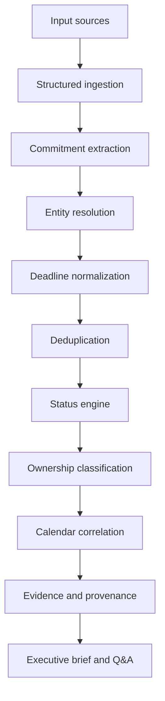

# Architecture

The implementation is deliberately deterministic. data_pack.py contains only supplied facts, services.py determines grounded classifications, and app.py renders the enterprise UI. Every item keeps sources, rationale, and evidence history.
